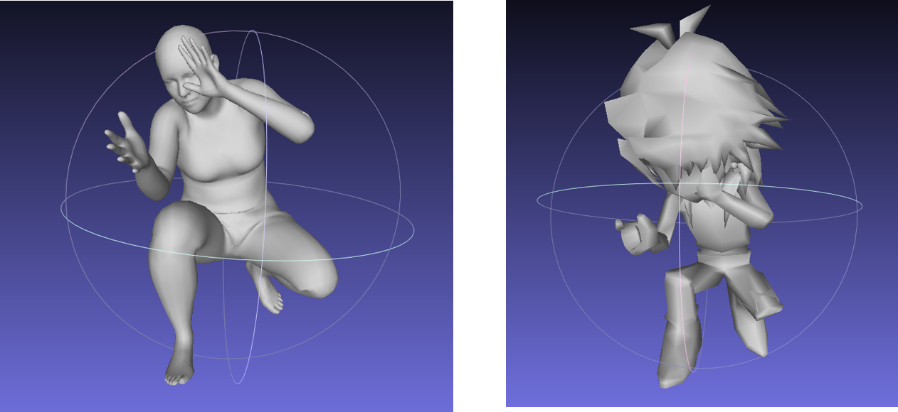
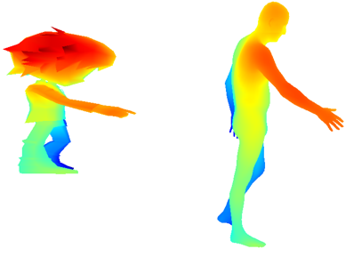

# Pose2Carton 

SJTU EE228 课程大作业/AI2612 课程作业：利用3D骨架控制3D卡通人物。

## Maya 环境配置
- 本项目在`Windows10(21H1)`下进行，使用`Maya 2020`.
对于Maya 2020的环境配置，考虑到本项目不涉及到在mayapy中使用额外的科学计算库(scipy,numpy)，那么个人过程如下：
(1)在官网下载maya2020.
(2)将maya的\bin路径加入PATH环境变量中.

- 如果你使用`Ubuntu`等Unix类系统，安装`Maya 2020`,那么我在这里提供Autodesk官方的一个方案：
(https://knowledge.autodesk.com/zh-hans/support/maya/learn-explore/caas/simplecontent/content/installing-maya-2020-ubuntu.html) (Autodesk官方安装方式)

- 如果你需要在`Maya 2020`的`mayapy`中使用包管理器(pip)以及科学计算库(numpy,scipy),那么可以参照下面的做法:`Windows10(21H1)`
(1) 下载`get-pip.py`
(2) 将maya的\bin路径加入PATH环境变量中,在`get-pip.py`的目录下执行`mayapy.exe ./get-pip.py`.
(3) `mayapy -m pip install -i https://pypi.anaconda.org/carlkl/simple numpy`
注意,这里提供的包是专门为mayapy重新包装的,和其他渠道的包不同,那些渠道的包由于mayapy的一些自行修改,不能在其中加载.

## 匹配流程
以下流程可能会在各个步骤出现一些报错，但是需要的文件正确生成即可。
如果有文件不能生成,可以自行考虑在blender等软件中进行操作直到能够生成,或者更换模型。
- 对于不自带材质信息的.obj文件,采用如下的流程：
  * 使用`open3d==0.11.1`.
  * 运行`transfer.py`得到这个文件对应的关节点。
  * 手动对关节点进行匹配，把匹配后的数据填入`manual_model_to_smpl`中,然后运行`transfer.py`.
  * 使用`vis.py`进行可视化。如果你发现可视化得到的模型匹配效果很差，考虑重新执行上一步。
- 对于自带材质信息的.fbx文件,采用如下的流程：
  * 使用`open3d==0.10.0`.
  * 运行`mayapy fbx_parser.py model.fbx`. 其中model.fbx由使用者自己提供.
  * 你会得到一系列文件,包括：
    * 存储材质的`model.fbm`文件夹
    * 一个用来构成模型的三角片集合`model.obj`和对应的`model.txt`
    * 一个用来构成模型的三角片集合`model_intermediate.obj`和对应的`model_intermediate.mtl`,后者是能让`model_intermediate.obj`在被打开的时候能够正确显示材质的必要文件.
    * 如果你的`model_intermediate.obj`不能显示材质,考虑参照一些标准文件修改你的`model_intermediate.mtl`.你可能需要附加`./model.fbm/...`之类的相对路径.
  * 运行`transfer.py`得到这个文件对应的关节点。
  * 手动对关节点进行匹配，把匹配后的数据填入`manual_model_to_smpl`中,然后运行`transfer.py`.
  * 使用`vis.py`进行可视化。如果你发现可视化得到的模型匹配效果很差，考虑重新执行上一步。如果你的可视化结果不含有材质,那么检查`obj_seq?_3dmodel`这个文件夹里面是否含有存储材质的`model.fbm`文件夹.
 
## 项目结果

这里放置来自你最终匹配结果的截图， 如

## 协议 
本项目在 Apache-2.0 协议下开源.

所涉及代码及数据的最终解释权归倪冰冰老师课题组所有.

**Group 3**
